# 🏗️ CliniQ Architecture

## System Architecture Overview

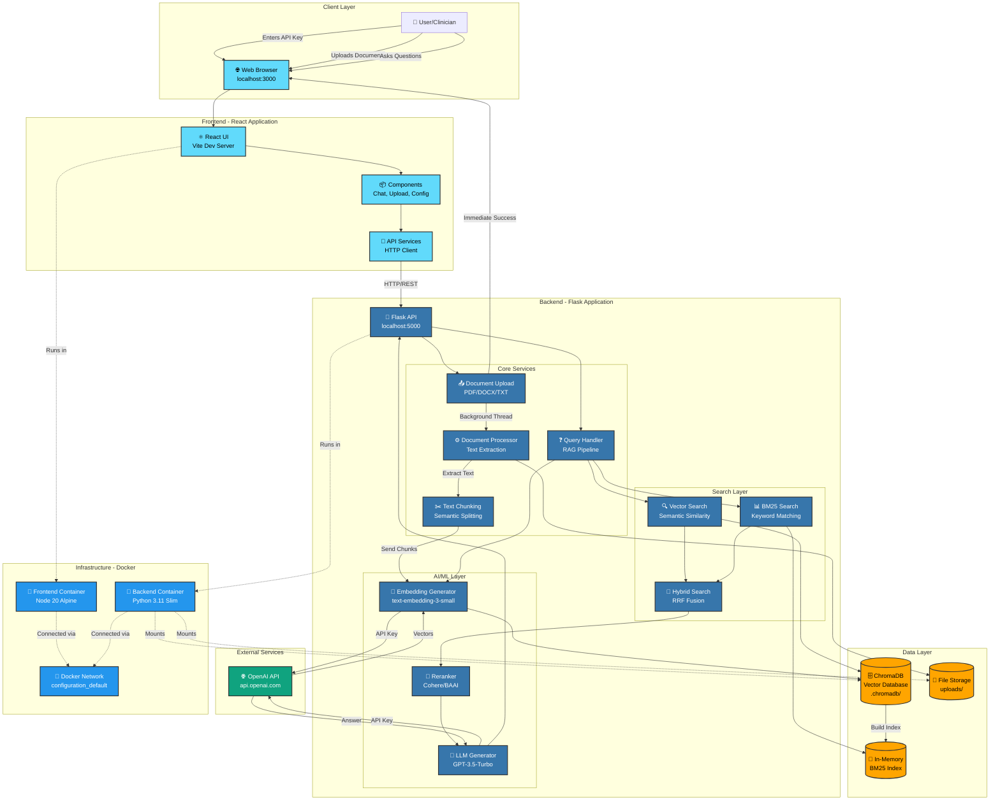

---

## 🔄 Data Flow Diagrams

### 1️⃣ Document Upload Flow

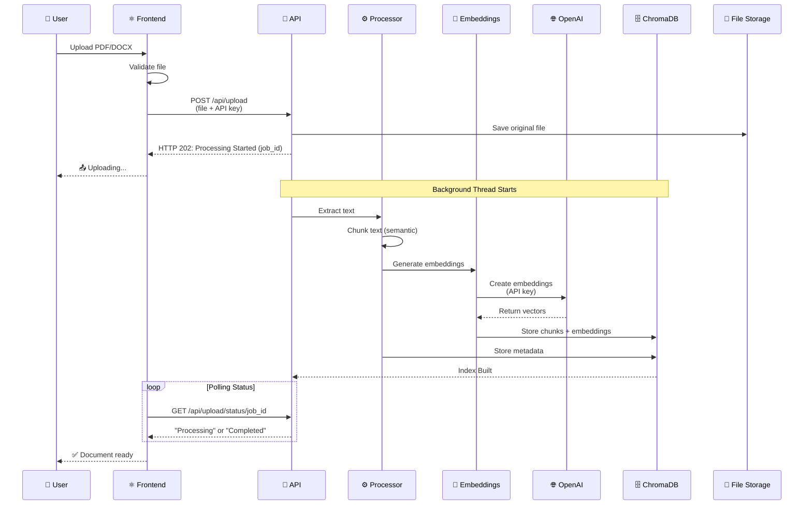

### 2️⃣ Query/Question Flow

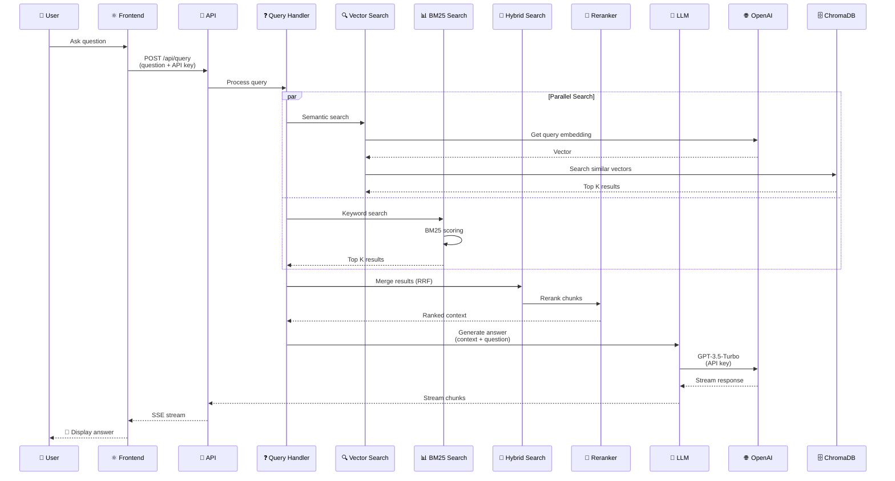

### 3️⃣ API Key Security Flow

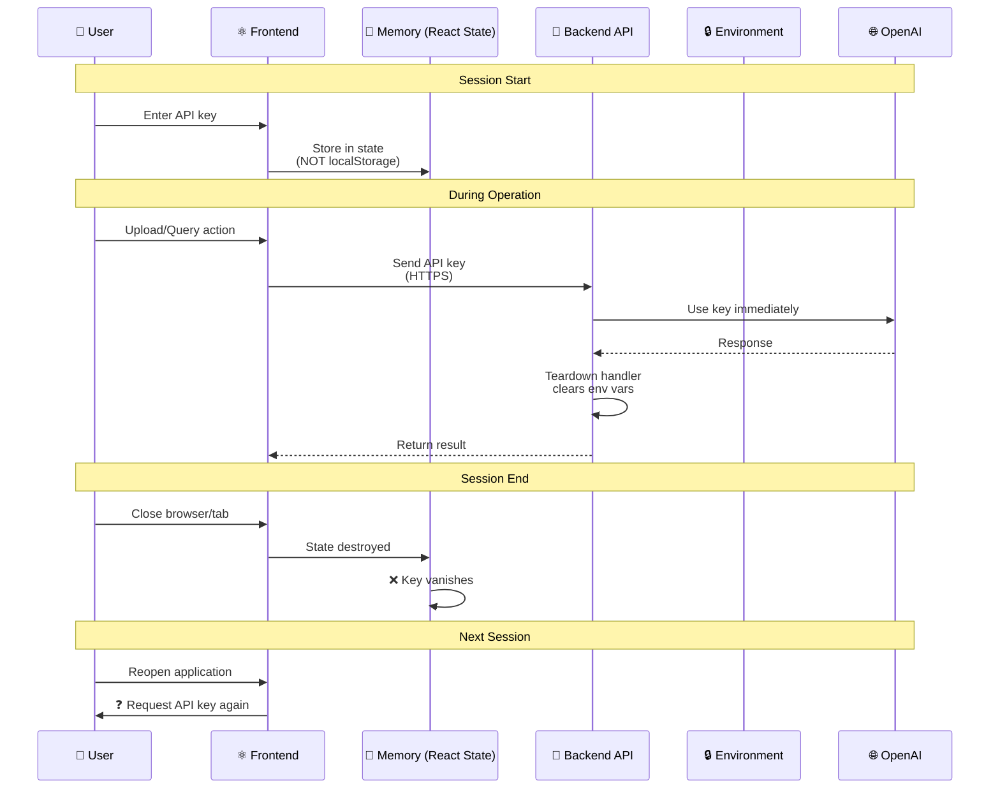

---

## 📦 Component Architecture

### Frontend Components

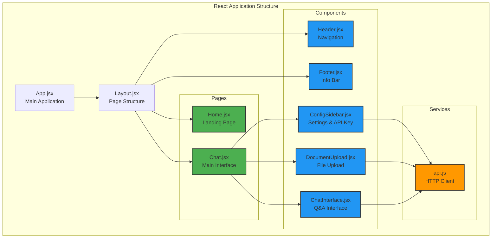

### Backend Services

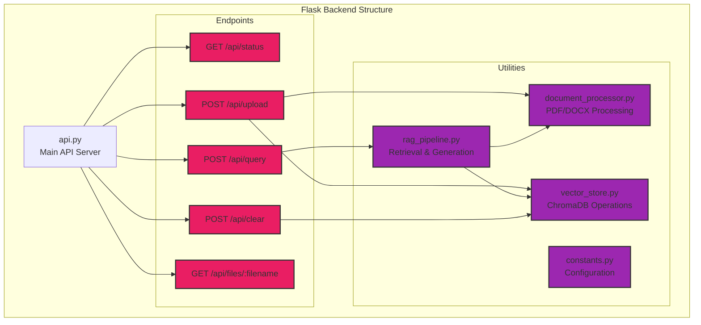

---

## 🐳 Docker Architecture

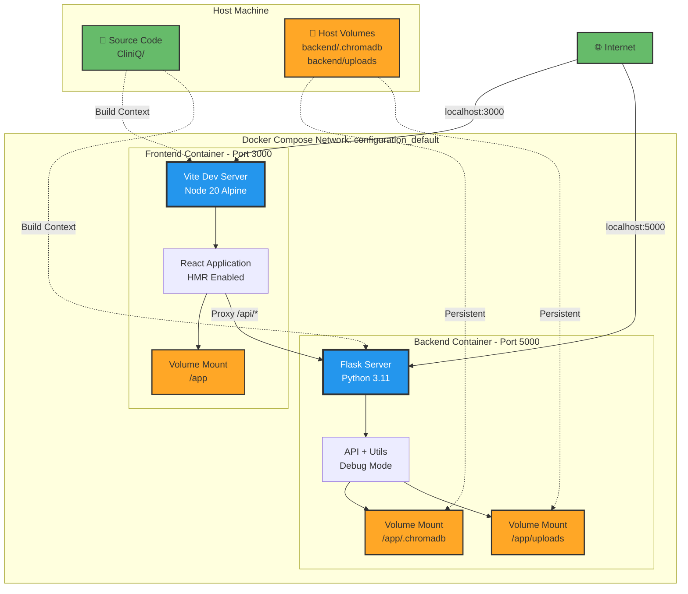

---

## 🔐 Security Architecture

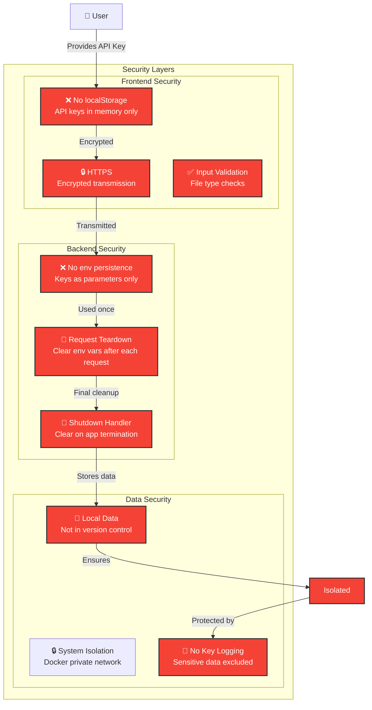

---

## 🔍 RAG Pipeline Detail

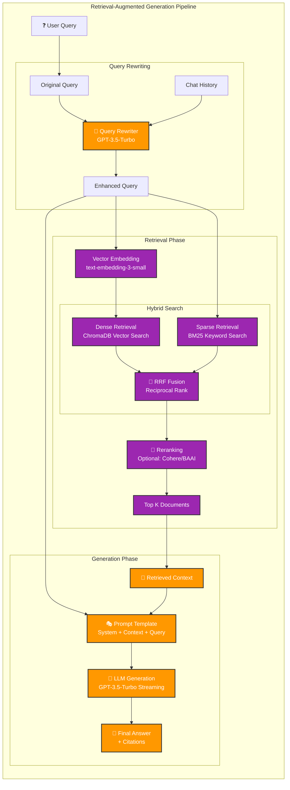

---

## 📊 Technology Stack

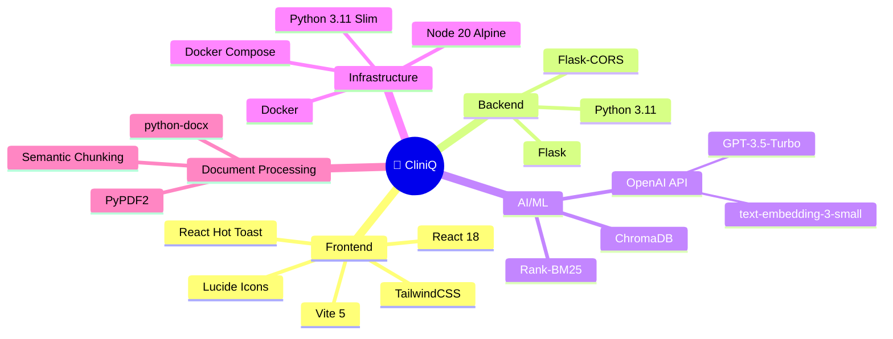

---

## 🎯 Key Design Principles

| Principle | Implementation |
|-----------|----------------|
| **🔒 Security First** | No API key persistence, cleared after each use |
| **📦 Modularity** | Separated concerns: Frontend, Backend, AI, Storage |
| **🐳 Containerization** | Docker for consistent environments |
| **🔄 Scalability** | Stateless API, can scale horizontally |
| **⚡ Performance** | Hybrid search, streaming responses |
| **💾 Persistence** | Local volumes for data, code in Git |
| **🎨 User Experience** | Real-time streaming, progress indicators |
| **📚 Documentation** | Comprehensive guides and inline comments |

---

## 📈 Deployment Architecture

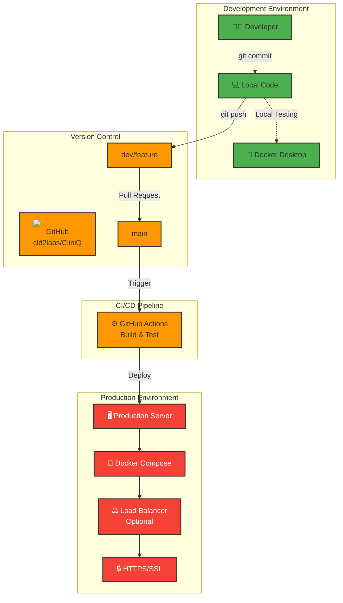

---

## 🚀 Quick Start Architecture

For users starting the application:

```mermaid
graph LR
    Start([▶️ Start]) --> Clone[git clone]
    Clone --> CD[cd CliniQ/configuration]
    CD --> Compose[docker-compose up --build]
    
    Compose --> BuildFront[🔨 Build Frontend<br/>npm install]
    Compose --> BuildBack[🔨 Build Backend<br/>pip install]
    
    BuildFront --> StartFront[▶️ Vite Server<br/>localhost:3000]
    BuildBack --> StartBack[▶️ Flask Server<br/>localhost:5000]
    
    StartFront --> Ready1[✅ Frontend Ready]
    StartBack --> Ready2[✅ Backend Ready]
    
    Ready1 --> Use[🎉 Use Application]
    Ready2 --> Use
    
    Use --> Enter[Enter API Key]
    Enter --> Upload[Upload Documents]
    Upload --> Ask[Ask Questions]
    Ask --> Answer[Get Answers]
    
    classDef action fill:#2196f3,stroke:#333,stroke-width:2px,color:#fff
    classDef ready fill:#4caf50,stroke:#333,stroke-width:2px
    
    class Clone,CD,Compose,BuildFront,BuildBack,StartFront,StartBack action
    class Ready1,Ready2,Use,Answer ready
```

---

**Last Updated:** January 2026  
**Version:** 2.0  
**Status:** ✅ Production Ready

