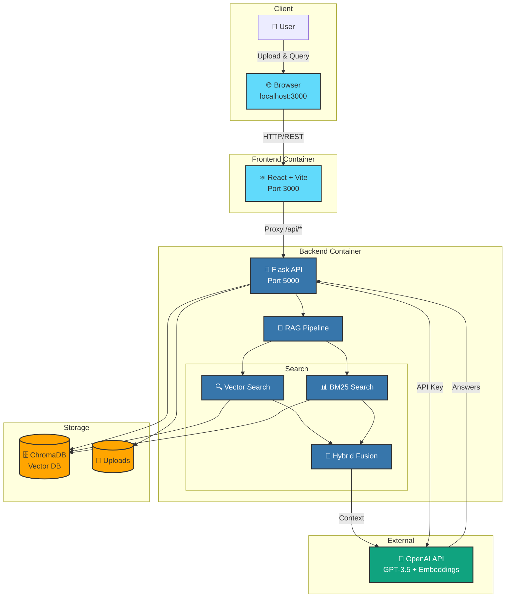

<p align="center">
  
</p>

<h1 align="center">ClinIQ 🏥 : Clinical Q&A Driven by Your Documents</h1>

<p align="center">
  <b>Transform clinical documents into an intelligent question-answering system using AI-powered RAG (Retrieval-Augmented Generation)</b>
</p>


## Overview

ClinIQ is a modern web application that allows healthcare professionals to upload clinical documents and ask questions in plain English. Using advanced AI techniques including hybrid search, reranking, and OpenAI's GPT models, it provides accurate, evidence-based answers with source citations.


---

## ✨ Features

- 📄 **Multi-Format Document Support**: Upload PDF, DOCX, or TXT files
- 🔍 **Advanced Search**: Hybrid search combining semantic (dense) and keyword (sparse) retrieval
- 🎯 **Intelligent Reranking**: Cosine similarity-based reranking for improved accuracy
- 💬 **Interactive Chat**: Natural language Q&A interface with conversation history
- 📚 **Source Citations**: Every answer includes citations from source documents
- 🤔 **AI Thinking Process**: Optional step-by-step reasoning display
- 🎨 **Modern UI**: Clean, responsive React-based interface
- 🐳 **Docker Support**: Containerized deployment for easy setup

---

## 🏗️ Architecture




### Key Components:
- **Backend**: Flask REST API (Python) - Port 5000
- **Frontend**: React + Vite (JavaScript) - Port 3000
- **Vector Database**: ChromaDB (local persistent storage)
- **AI Models**: OpenAI GPT-3.5-Turbo & text-embedding-3-small

---

## 📋 Prerequisites

### For Local Development:
- **Python 3.10+**
- **Node.js 18+** and npm
- **OpenAI API Key** ([Get one here](https://platform.openai.com/account/api-keys))

### For Docker:
- **Docker Desktop** ([Download here](https://www.docker.com/products/docker-desktop/))

---

## 🚀 Quick Start

### Option 1: Local Development (React + Flask)

#### Step 1: Clone the Repository

```bash
git clone <your-repo-url>
cd CliniQ
```

#### Step 2: Install Backend Dependencies

```bash
cd backend
pip install -r requirements.txt
cd ..
```

#### Step 3: Install Frontend Dependencies

```bash
cd frontend
npm install
cd ..
```

#### Step 4: Start the Backend

Open a terminal and run:

```bash
cd backend
python api.py
```

The backend will start on `http://localhost:5000`

#### Step 5: Start the Frontend

Open another terminal and run:

```bash
cd frontend
npm run dev
```

The frontend will start on `http://localhost:3000`

#### Step 6: Access the Application

1. Open your browser and navigate to `http://localhost:3000`
2. Enter your OpenAI API key in the configuration panel
3. Upload a clinical document (PDF, DOCX, or TXT)
4. Start asking questions!

---

### Option 2: Docker Deployment

#### Step 1: Clone the Repository

```bash
git clone <your-repo-url>
cd clinical-rag
```

#### Step 2: Build and Run with Docker Compose

From the root directory:

```bash
docker-compose -f configuration/docker-compose.yml up --build
```

Or navigate to the configuration folder:

```bash
cd configuration
docker-compose up --build
```

This single command will:
- Build the backend container (Flask API)
- Build the frontend container (React app)
- Start both services automatically
- Frontend: `http://localhost:3000`
- Backend: `http://localhost:5000`

#### Step 3: Access the Application

1. Open your browser and navigate to `http://localhost:3000`
2. Enter your OpenAI API key in the configuration panel
3. Upload a clinical document
4. Start asking questions!

#### Docker Commands

```bash
# Run in background (detached mode)
docker-compose up -d --build

# View logs
docker-compose logs -f

# Stop services
docker-compose down

# Rebuild after changes
docker-compose up --build --force-recreate
```

## 🎯 How to Use

### 1. First Time Setup

1. **Open the application** at `http://localhost:3000`
2. **Enter your OpenAI API key** in the configuration panel (left sidebar)
3. **Upload a clinical document** using the file uploader

### 2. Asking Questions

1. Type your question in the chat input
2. Examples:
   - "What are the contraindications for this medication?"
   - "How should I monitor this patient's vital signs?"
   - "What follow-up care is recommended?"
3. Review the answer with source citations


## 🧠 How It Works

### 1. Document Processing
- Extracts text from PDF/DOCX/TXT files
- Chunks text into manageable pieces (800 tokens with 150 token overlap)
- Creates embeddings using OpenAI's `text-embedding-3-small`

### 2. Storage
- Stores document chunks in ChromaDB (local vector database)
- Maintains metadata (source file, chunk ID, page numbers)

### 3. Query Processing
- **Hybrid Search**: Combines dense (semantic) and sparse (BM25 keyword) search using Reciprocal Rank Fusion (RRF)
- **Reranking**: Re-ranks results using cosine similarity with query embedding
- Retrieves top relevant chunks

### 4. Answer Generation
- Feeds relevant chunks to GPT-3.5-Turbo
- Generates answer based ONLY on document content
- Includes source citations

---

## 📁 Project Structure

```
clinical-rag/
├── README.md                 # Main documentation
├── LICENSE  
├── .gitignore               # Git ignore rules
│
├── backend/                  # Backend Python application
│   ├── api.py               # Flask REST API
│   ├── app.py               # Legacy Streamlit app (optional)
│   ├── requirements.txt     # Python dependencies
│   ├── Dockerfile           # Backend Docker configuration
│   ├── test_openai_api.py   # API testing utility
│   │
│   └── utils/              # Backend utilities
│       ├── __init__.py
│       ├── constants.py     # Model constants
│       ├── document_processor.py # Document extraction & chunking
│       ├── rag_pipeline.py  # RAG query processing
│       └── vector_store.py  # ChromaDB & search operations
│
├── frontend/                # React frontend
│   ├── package.json
│   ├── vite.config.js
│   ├── tailwind.config.js
│   ├── Dockerfile           # Frontend Docker configuration
│   │
│   ├── public/              # Static assets
│   │   └── cloud2labs-logo.png
│   │
│   └── src/
│       ├── main.jsx         # Entry point
│       ├── App.jsx         # Main app component
│       ├── index.css        # Global styles
│       │
│       ├── components/      # React components
│       │   ├── DocumentUpload.jsx
│       │   ├── ChatInterface.jsx
│       │   ├── ConfigSidebar.jsx
│       │   └── layout/
│       │       ├── Header.jsx
│       │       ├── Footer.jsx
│       │       └── Layout.jsx
│       │
│       ├── pages/          # Page components
│       │   ├── Home.jsx
│       │   └── Chat.jsx
│       │
│       └── services/       # API service layer
│           └── api.js
│
├── configuration/          # Configuration files
│   └── docker-compose.yml # Docker Compose configuration
│
├── Docs/                  # Documentation
│   ├── DOCKER_SETUP.md
│   ├── PROJECT_DOCUMENTATION.md
│   ├── QUICKSTART.md
│  
│
├── .chromadb/             # ChromaDB data (gitignored)
└── uploads/               # Uploaded files (gitignored)
```

---


## 📝 Environment Variables

### Backend

- `FLASK_ENV`: `development` or `production`
- `OPENAI_API_KEY`: Your OpenAI API key (optional, can be set in UI)

### Frontend

- `VITE_BACKEND_ENDPOINT`: Backend API URL (default: `http://localhost:5000`)


