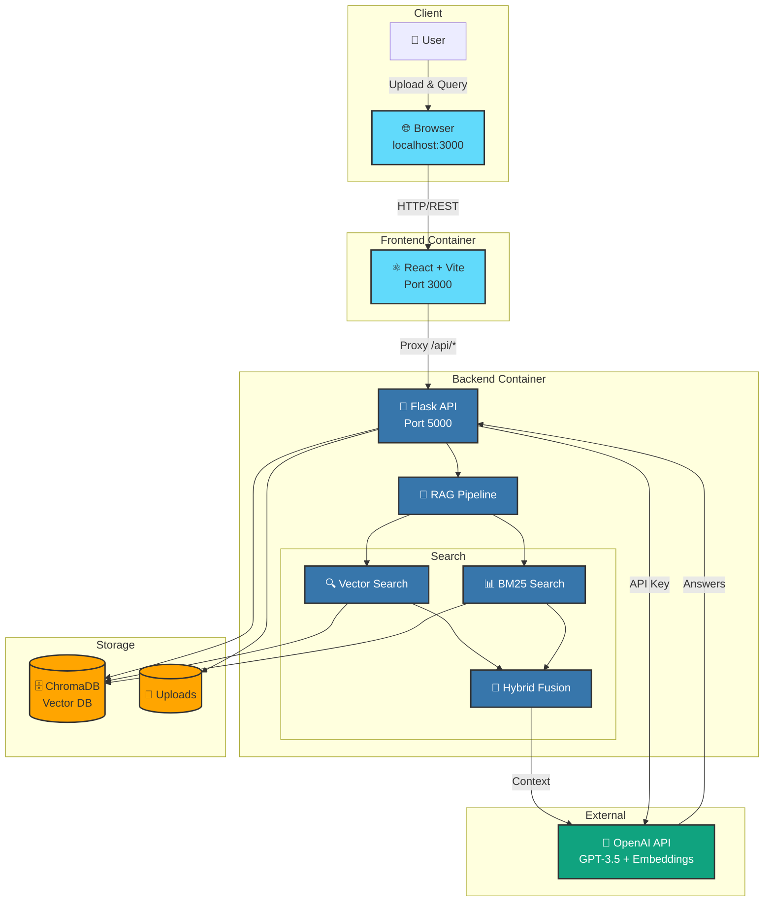

<p align="center">
  
</p>

<h1 align="center">ClinIQ 🏥 : Clinical Q&A Driven by Your Documents</h1>

<p align="center">
  <b>Transform clinical documents into an intelligent question-answering system using AI-powered RAG (Retrieval-Augmented Generation)</b>
</p>


## Overview

ClinIQ is a modern web application that allows healthcare professionals to upload clinical documents and ask questions in plain English. Using advanced AI techniques including hybrid search, reranking, and OpenAI's GPT models, it provides accurate, evidence-based answers with source citations.

---


---

## ✨ Features

- 📄 **Multi-Format Document Support**: Upload PDF, DOCX, or TXT files
- 🔍 **Advanced Search**: Hybrid search combining semantic (dense) and keyword (sparse) retrieval
- 🎯 **Intelligent Reranking**: Cosine similarity-based reranking for improved accuracy
- 💬 **Interactive Chat**: Natural language Q&A interface with conversation history
- 📚 **Source Citations**: Every answer includes citations from source documents
- 🤔 **AI Thinking Process**: Optional step-by-step reasoning display
- 🎨 **Modern UI**: Clean, responsive React-based interface
- 🐳 **Docker Support**: Containerized deployment for easy setup

---

## 🏗️ Architecture




### Key Components:
- **Backend**: Flask REST API (Python) - Port 5000
- **Frontend**: React + Vite (JavaScript) - Port 3000
- **Vector Database**: ChromaDB (local persistent storage)
- **AI Models**: OpenAI GPT-3.5-Turbo & text-embedding-3-small

---

## 📋 Prerequisites

### For Local Development:
- **Python 3.10+**
- **Node.js 18+** and npm
- **OpenAI API Key** ([Get one here](https://platform.openai.com/account/api-keys))

### For Docker:
- **Docker Desktop** ([Download here](https://www.docker.com/products/docker-desktop/))

---

## 🚀 Quick Start

### Option 1: Local Development (React + Flask)

#### Step 1: Clone the Repository

```bash
git clone <your-repo-url>
cd CliniQ
```

#### Step 2: Install Backend Dependencies

```bash
cd backend
pip install -r requirements.txt
cd ..
```

#### Step 3: Install Frontend Dependencies

```bash
cd frontend
npm install
cd ..
```

#### Step 4: Start the Backend

Open a terminal and run:

```bash
cd backend
python api.py
```

The backend will start on `http://localhost:5000`

#### Step 5: Start the Frontend

Open another terminal and run:

```bash
cd frontend
npm run dev
```

The frontend will start on `http://localhost:3000`

#### Step 6: Access the Application

1. Open your browser and navigate to `http://localhost:3000`
2. Enter your OpenAI API key in the configuration panel
3. Upload a clinical document (PDF, DOCX, or TXT)
4. Start asking questions!

---

### Option 2: Docker Deployment

#### Step 1: Clone the Repository

```bash
git clone <your-repo-url>
cd clinical-rag
```

#### Step 2: Build and Run with Docker Compose

From the root directory:

```bash
docker-compose -f configuration/docker-compose.yml up --build
```

Or navigate to the configuration folder:

```bash
cd configuration
docker-compose up --build
```

This single command will:
- Build the backend container (Flask API)
- Build the frontend container (React app)
- Start both services automatically
- Frontend: `http://localhost:3000`
- Backend: `http://localhost:5000`

#### Step 3: Access the Application

1. Open your browser and navigate to `http://localhost:3000`
2. Enter your OpenAI API key in the configuration panel
3. Upload a clinical document
4. Start asking questions!

#### Docker Commands

```bash
# Run in background (detached mode)
docker-compose up -d --build

# View logs
docker-compose logs -f

# Stop services
docker-compose down

# Rebuild after changes
docker-compose up --build --force-recreate
```

## 🎯 How to Use

### 1. First Time Setup

1. **Open the application** at `http://localhost:3000`
2. **Enter your OpenAI API key** in the configuration panel (left sidebar)
3. **Upload a clinical document** using the file uploader

### 2. Asking Questions

1. Type your question in the chat input
2. Examples:
   - "What are the contraindications for this medication?"
   - "How should I monitor this patient's vital signs?"
   - "What follow-up care is recommended?"
3. Review the answer with source citations


## 🧠 How It Works

### 1. Document Processing
- Extracts text from PDF/DOCX/TXT files
- Chunks text into manageable pieces (800 tokens with 150 token overlap)
- Creates embeddings using OpenAI's `text-embedding-3-small`

### 2. Storage
- Stores document chunks in ChromaDB (local vector database)
- Maintains metadata (source file, chunk ID, page numbers)

### 3. Query Processing
- **Hybrid Search**: Combines dense (semantic) and sparse (BM25 keyword) search using Reciprocal Rank Fusion (RRF)
- **Reranking**: Re-ranks results using cosine similarity with query embedding
- Retrieves top relevant chunks

### 4. Answer Generation
- Feeds relevant chunks to GPT-3.5-Turbo
- Generates answer based ONLY on document content
- Includes source citations

---

## 📁 Project Structure

```
CliniQ/
├── README.md                         # Main documentation (this file)
├── ARCHITECTURE.md                   # Detailed architecture diagrams
├── LICENSE  
├── .gitignore                       # Git ignore rules (excludes .chromadb/, uploads/)
│
├── backend/                          # Backend Python Flask Application
│   ├── api.py                       # 🔥 Main Flask REST API server (614 lines)
│   │                                #    - 7 API endpoints
│   │                                #    - Background document processing
│   │                                #    - SSE streaming support
│   │                                #    - Security teardown handlers
│   │
│   ├── requirements.txt             # Python dependencies
│   │                                #    Flask, OpenAI, ChromaDB, PyPDF2, etc.
│   ├── Dockerfile                   # Backend Docker configuration
│   │                                #    - Python 3.11 slim base
│   │                                #    - UTF-8 environment setup
│   │                                #    - Volume mounts for persistence
│   │
│   └── utils/                       # Core backend utilities
│       ├── __init__.py
│       │
│       ├── constants.py             # Model configuration (26 lines)
│       │                            #    - DEFAULT_CHAT_MODEL = "gpt-3.5-turbo"
│       │                            #    - DEFAULT_EMBEDDING_MODEL = "text-embedding-3-small"
│       │
│       ├── document_processor.py    # Document processing (258 lines)
│       │                            #    - PDF extraction (PyPDF2)
│       │                            #    - DOCX extraction (python-docx)
│       │                            #    - Semantic chunking (tiktoken)
│       │                            #    - Embedding creation (OpenAI API)
│       │
│       ├── rag_pipeline.py          # 🔥 RAG pipeline implementation (686 lines)
│       │                            #    - Query rewriting (conversation context)
│       │                            #    - Context retrieval & citations
│       │                            #    - Answer generation (streaming + non-streaming)
│       │                            #    - Thinking/answer parsing
│       │                            #    - Smart citation clearing
│       │                            #    - Robust buffering logic
│       │
│       └── vector_store.py          # 🔥 Search & storage (743 lines)
│                                    #    - ChromaDB operations (init, add, clear)
│                                    #    - Dense search (semantic similarity)
│                                    #    - Sparse search (BM25 keyword)
│                                    #    - Hybrid search (RRF fusion)
│                                    #    - Reranking (cosine similarity)
│
├── frontend/                        # React + Vite Frontend Application
│   ├── package.json                 # Dependencies: React, TailwindCSS, Lucide icons
│   ├── vite.config.js              # Vite configuration (proxy to backend)
│   ├── tailwind.config.js          # TailwindCSS configuration
│   ├── Dockerfile                  # Frontend Docker configuration (Node 20 Alpine)
│   │
│   ├── public/                     # Static assets
│   │   └── cloud2labs-logo.png
│   │
│   └── src/
│       ├── main.jsx                # React entry point
│       ├── App.jsx                 # Main app component (routing)
│       ├── index.css               # Global TailwindCSS styles
│       │
│       ├── components/             # React components
│       │   ├── DocumentUpload.jsx  # File upload with drag-and-drop
│       │   │                       #   - Multi-file support
│       │   │                       #   - File validation
│       │   │                       #   - Upload progress tracking
│       │   │
│       │   ├── ChatInterface.jsx   # 🔥 Chat UI (311 lines)
│       │   │                       #   - Message display (user + assistant)
│       │   │                       #   - Real-time streaming accumulation
│       │   │                       #   - Thinking process display
│       │   │                       #   - Citation rendering with links
│       │   │                       #   - Error handling
│       │   │
│       │   ├── ConfigSidebar.jsx   # Configuration panel
│       │   │                       #   - API key input (memory-only)
│       │   │                       #   - Hybrid search toggle
│       │   │                       #   - Reranker toggle
│       │   │                       #   - Thinking mode toggle
│       │   │                       #   - Model info display
│       │   │
│       │   └── layout/
│       │       ├── Header.jsx      # App header with logo
│       │       ├── Footer.jsx      # Footer with tech info
│       │       └── Layout.jsx      # Main layout wrapper
│       │
│       ├── pages/                  # Page components
│       │   ├── Home.jsx            # Landing page
│       │   └── Chat.jsx            # 🔥 Main chat page (164 lines)
│       │                           #   - State management (API key, documents, config)
│       │                           #   - Document status polling
│       │                           #   - Upload success handling
│       │                           #   - RAG technology badges
│       │
│       └── services/
│           └── api.js              # API service layer
│                                   #   - uploadDocument()
│                                   #   - queryDocuments() with SSE streaming
│                                   #   - getStatus()
│                                   #   - clearDocuments()
│
├── configuration/                  # Docker & deployment configuration
│   └── docker-compose.yml          # Docker Compose orchestration
│                                   #   - Frontend service (port 3000)
│                                   #   - Backend service (port 5000)
│                                   #   - Volume mounts (code, data)
│                                   #   - Network configuration
│
├── Docs/                           # Project documentation
│   ├── ARCHITECTURE.md             # 🔗 Link to root ARCHITECTURE.md
│   ├── DOCKER_SETUP.md             # Docker deployment guide
│   ├── PROJECT_DOCUMENTATION.md    # Comprehensive project docs
│   ├── QUICKSTART.md               # Quick start guide
│   └── assets/                     # Documentation assets
│       └── demo.gif                # Application demo
│
├── .chromadb/                      # 🔒 ChromaDB persistent storage (gitignored)
│   └── [vector database files]    #     - Document embeddings
│                                   #     - Metadata & indexes
│
└── uploads/                        # 🔒 Uploaded document files (gitignored)
    └── [user-uploaded files]       #     - PDF, DOCX, TXT files
```
---


## 📝 Environment Variables

### Backend

- `FLASK_ENV`: `development` or `production`
- `OPENAI_API_KEY`: Your OpenAI API key (optional, can be set in UI)

### Frontend

- `VITE_BACKEND_ENDPOINT`: Backend API URL (default: `http://localhost:5000`)


