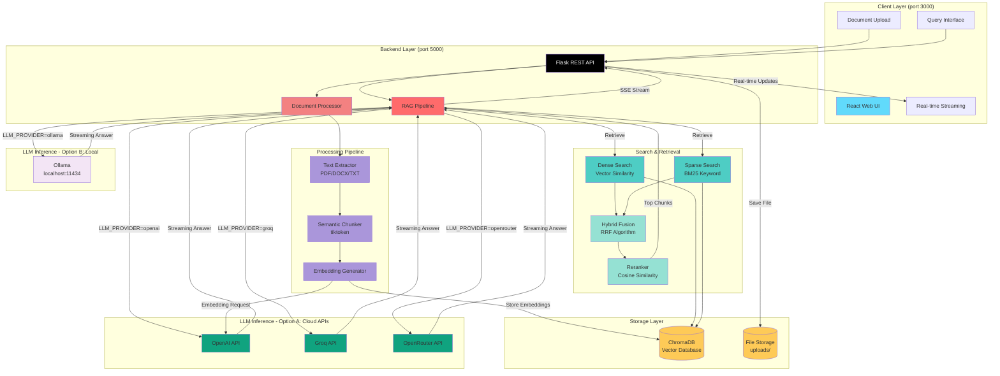

<p align="center">
  
</p>

# ClinIQ — Clinical Q&A AI Assistant

An AI-powered clinical document analysis platform using RAG (Retrieval-Augmented Generation), hybrid search, and intelligent reranking for evidence-based medical question answering. Upload clinical documents (PDF, DOCX, or TXT) and ask questions in natural language — powered by any OpenAI-compatible LLM endpoint, Groq, OpenRouter, or a locally running Ollama model.

---

## Table of Contents

- [ClinIQ — Clinical Q&A AI Assistant](#cliniq--clinical-qa-ai-assistant)
  - [Table of Contents](#table-of-contents)
  - [Project Overview](#project-overview)
  - [How It Works](#how-it-works)
  - [Architecture](#architecture)
    - [Architecture Diagram](#architecture-diagram)
    - [Service Components](#service-components)
    - [Typical Flow](#typical-flow)
  - [Get Started](#get-started)
    - [Prerequisites](#prerequisites)
      - [Verify Installation](#verify-installation)
    - [Quick Start (Docker Deployment)](#quick-start-docker-deployment)
      - [1. Clone the Repository](#1-clone-the-repository)
      - [2. Configure the Environment](#2-configure-the-environment)
      - [3. Build and Start the Application](#3-build-and-start-the-application)
      - [4. Access the Application](#4-access-the-application)
      - [5. Verify Services](#5-verify-services)
      - [6. Stop the Application](#6-stop-the-application)
    - [Local Development Setup](#local-development-setup)
  - [Project Structure](#project-structure)
  - [Usage Guide](#usage-guide)
    - [Using ClinIQ](#using-cliniq)
    - [Advanced Features](#advanced-features)
    - [Best Practices](#best-practices)
  - [Inference Benchmarks](#inference-benchmarks)
  - [Model Capabilities](#model-capabilities)
    - [Meta-Llama-3.2-3B-Instruct](#meta-llama-32-3b-instruct)
    - [GPT-4o-mini](#gpt-4o-mini)
    - [Comparison Summary](#comparison-summary)
  - [LLM Provider Configuration](#llm-provider-configuration)
    - [OpenAI](#openai)
    - [Groq](#groq)
    - [Ollama](#ollama)
    - [OpenRouter](#openrouter)
    - [Custom OpenAI-Compatible API](#custom-openai-compatible-api)
    - [Switching Providers](#switching-providers)
  - [Environment Variables](#environment-variables)
    - [Core LLM Configuration](#core-llm-configuration)
    - [Model Configuration](#model-configuration)
    - [Generation Parameters](#generation-parameters)
    - [Security Configuration](#security-configuration)
    - [Server Configuration](#server-configuration)
  - [Technology Stack](#technology-stack)
    - [Backend](#backend)
    - [Frontend](#frontend)
    - [Infrastructure](#infrastructure)
    - [AI/ML Techniques](#aiml-techniques)
  - [Troubleshooting](#troubleshooting)
    - [Common Issues](#common-issues)
    - [Debug Mode](#debug-mode)
  - [License](#license)
  - [Disclaimer](#disclaimer)

---

## Project Overview

**ClinIQ** is an intelligent clinical question-answering platform that transforms uploaded medical documents into a searchable knowledge base using advanced RAG techniques. Healthcare professionals can ask questions in natural language and receive accurate, evidence-based answers with source citations.

This makes ClinIQ suitable for:

- **Enterprise deployments** — connect to a GenAI Gateway or any managed LLM API
- **Air-gapped environments** — run fully offline with Ollama and a locally hosted model
- **Local experimentation** — quick setup on a laptop with GPU-accelerated inference
- **Multi-provider flexibility** — switch between OpenAI, Groq, OpenRouter, Ollama, or custom endpoints

---

## How It Works

1. **Document Upload**: Users upload clinical documents (PDF, DOCX, or TXT) through the web interface. The system validates file formats and initiates background processing.

2. **Intelligent Processing**: Documents are extracted, chunked using semantic boundaries (800 tokens with 150 token overlap), and converted to vector embeddings using the configured embedding model.

3. **Hybrid Search**: When users ask questions, ClinIQ employs a dual-search strategy combining dense vector search (semantic similarity) and sparse BM25 search (keyword matching), fused using Reciprocal Rank Fusion (RRF) for optimal retrieval.

4. **Intelligent Reranking**: Retrieved chunks are reranked using cosine similarity with the query embedding to ensure the most relevant context is prioritized.

5. **Answer Generation**: The top-ranked context is fed to the configured LLM with a carefully designed prompt that enforces evidence-based reasoning, includes source citations, and displays step-by-step thinking when enabled.

The platform stores embeddings in ChromaDB for fast retrieval and supports real-time streaming responses for a responsive user experience. All answers include citations linking back to source documents, ensuring clinical traceability.

---

## Architecture

This application uses a modern microservices architecture with a React frontend, Flask REST API backend, and ChromaDB vector database. The RAG pipeline implements hybrid search combining dense and sparse retrieval methods, followed by intelligent reranking for optimal context selection. The LLM layer is fully pluggable — any OpenAI-compatible remote endpoint, Groq, OpenRouter, or a locally running Ollama instance can be used via environment configuration.

### Architecture Diagram



### Service Components

| Service       | Container     | Host Port | Description                                                                                     |
| ------------- | ------------- | --------- | ----------------------------------------------------------------------------------------------- |
| `backend`     | `backend`     | `5000`    | Flask REST API — document processing, RAG pipeline orchestration, streaming responses           |
| `frontend`    | `frontend`    | `3000`    | React UI — document upload with drag-and-drop, real-time chat, streaming responses, citations  |

**Core Components:**

1. **React Web UI (Port 3000)** - Document upload with drag-and-drop, real-time query interface with streaming responses, chat history with syntax-highlighted citations, and thinking process visualization

2. **Flask REST API (Port 5000)** - API routing and request validation, orchestrates document processing pipeline, manages ChromaDB connections and operations, streams responses via Server-Sent Events (SSE), implements background processing for uploads

3. **RAG Pipeline** - Query rewriting with conversation context, hybrid search with RRF fusion, cosine similarity reranking, answer generation with configured LLM, thinking and answer section parsing, source citation generation

4. **Search & Retrieval System**:
   - **Dense Search**: Vector similarity using embeddings for semantic matching
   - **Sparse Search**: BM25 algorithm for keyword-based retrieval
   - **Hybrid Fusion**: Reciprocal Rank Fusion (RRF) combines both methods
   - **Reranker**: Cosine similarity reranking for final context selection

5. **Document Processing Pipeline**:
   - **Text Extractor**: Supports PDF (PyPDF2), DOCX (python-docx), and TXT
   - **Semantic Chunker**: Uses tiktoken for token-aware chunking (800 tokens, 150 overlap)
   - **Embedding Generator**: Creates embeddings via configured embedding model

6. **ChromaDB** - Persistent vector database storing document embeddings, chunk metadata (source, page numbers, chunk IDs), and BM25 sparse indexes for hybrid search

7. **File Storage** - Manages uploaded document files in `uploads/` directory

8. **LLM Inference** - Pluggable inference layer supporting OpenAI, Groq, Ollama, OpenRouter, and custom OpenAI-compatible APIs

### Typical Flow

1. User uploads clinical document (PDF/DOCX/TXT) via web UI
2. Backend saves file and initiates background processing
3. Document processor extracts text and creates semantic chunks
4. Embedding generator creates vector embeddings for each chunk
5. Embeddings and metadata stored in ChromaDB with BM25 index
6. User submits natural language query
7. Query is embedded and sent to hybrid search system
8. Dense search finds semantically similar chunks via vector similarity
9. Sparse search finds keyword-matching chunks via BM25
10. RRF algorithm fuses results from both methods
11. Reranker applies cosine similarity to prioritize best chunks
12. Top context is sent to configured LLM with system prompt
13. AI generates answer with thinking process and citations
14. Response streams back to user in real-time via SSE
15. Citations link to specific source documents and pages

---

## Get Started

### Prerequisites

Before you begin, ensure you have the following installed and configured:

- **Docker and Docker Compose** (v2)
  - [Install Docker](https://docs.docker.com/get-docker/)
  - [Install Docker Compose](https://docs.docker.com/compose/install/)
- An LLM provider — one of:
  - OpenAI: [Get API Key](https://platform.openai.com/account/api-keys)
  - Groq: [Get API Key](https://console.groq.com/)
  - OpenRouter: [Get API Key](https://openrouter.ai/keys)
  - [Ollama](https://ollama.com/download) installed natively (no API key needed)
  - Any custom OpenAI-compatible API endpoint

#### Verify Installation

```bash
# Check Docker
docker --version
docker compose version

# Verify Docker is running
docker ps
```

### Quick Start (Docker Deployment)

#### 1. Clone the Repository

```bash
git clone https://github.com/cld2labs/ClinIQ.git
cd ClinIQ
```

#### 2. Configure the Environment

```bash
# Copy the example environment file
cp backend/.env.example backend/.env
```

Open `backend/.env` and configure your LLM provider. See [LLM Provider Configuration](#llm-provider-configuration) for detailed per-provider instructions.

**Example for OpenAI:**
```bash
LLM_PROVIDER=openai
LLM_API_KEY=sk-your-api-key-here
LLM_BASE_URL=https://api.openai.com/v1
LLM_CHAT_MODEL=gpt-3.5-turbo
LLM_EMBEDDING_MODEL=text-embedding-3-small
```

**Example for Ollama:**
```bash
LLM_PROVIDER=ollama
LLM_BASE_URL=http://localhost:11434/v1
LLM_CHAT_MODEL=qwen2.5:7b
LLM_EMBEDDING_MODEL=nomic-embed-text
# LLM_API_KEY not needed for Ollama
```

#### 3. Build and Start the Application

```bash
# Standard (attached)
docker compose up --build

# Detached (background)
docker compose up -d --build
```

#### 4. Access the Application

Once containers are running:

- **Frontend UI**: http://localhost:3000
- **Backend API**: http://localhost:5000
- **Health Check**: http://localhost:5000/api/health

#### 5. Verify Services

```bash
# Health check
curl http://localhost:5000/api/health

# View running containers
docker compose ps
```

**View logs:**

```bash
# All services
docker compose logs -f

# Backend only
docker compose logs -f backend

# Frontend only
docker compose logs -f frontend
```

#### 6. Stop the Application

```bash
docker compose down
```

---

### Local Development Setup

**For developers who want to run services locally without Docker**

**Backend (Python / Flask)**

```bash
cd backend

# Create virtual environment
python -m venv venv
source venv/bin/activate        # On Windows: venv\Scripts\activate

# Install dependencies
pip install -r requirements.txt

# Configure environment
cp .env.example .env
# Edit .env with your LLM provider settings

# Start backend
python api.py
```

Backend will run on `http://localhost:5000`

**Frontend (Node / Vite)**

```bash
cd frontend

# Install dependencies
npm install

# Start frontend
npm run dev
```

Frontend will run on `http://localhost:3000`

**Note**: The frontend Vite proxy automatically forwards `/api/*` requests to `http://localhost:5000`, so no additional configuration is needed for local development.

---

## Project Structure

```
ClinIQ/
├── backend/                          # Backend Flask Application
│   ├── api.py                       # Main Flask REST API server
│   │                                #   - 7 API endpoints
│   │                                #   - Background document processing
│   │                                #   - SSE streaming support
│   │                                #   - Health checks and status
│   │
│   ├── config.py                    # Multi-provider LLM configuration
│   │                                #   - LLM_PROVIDER selection
│   │                                #   - API key management
│   │                                #   - Base URL configuration
│   │                                #   - Model selection
│   │                                #   - Generation parameters
│   │
│   ├── utils/                       # Core backend utilities
│   │   ├── __init__.py
│   │   │
│   │   ├── constants.py             # Model configuration constants
│   │   │
│   │   ├── document_processor.py   # Document processing
│   │   │                            #   - PDF extraction (PyPDF2)
│   │   │                            #   - DOCX extraction (python-docx)
│   │   │                            #   - Semantic chunking (tiktoken)
│   │   │                            #   - Embedding creation
│   │   │
│   │   ├── rag_pipeline.py         # RAG pipeline implementation
│   │   │                            #   - Query rewriting
│   │   │                            #   - Context retrieval & citations
│   │   │                            #   - Answer generation (streaming)
│   │   │                            #   - Thinking/answer parsing
│   │   │
│   │   └── vector_store.py         # Search & storage
│   │                                #   - ChromaDB operations
│   │                                #   - Dense search (semantic)
│   │                                #   - Sparse search (BM25)
│   │                                #   - Hybrid search (RRF fusion)
│   │                                #   - Reranking (cosine similarity)
│   │
│   ├── .env.example                # Environment variable template
│   │                                #   - Multi-provider configuration
│   │                                #   - All supported variables
│   │
│   ├── requirements.txt            # Python dependencies
│   └── Dockerfile                  # Backend container configuration
│
├── frontend/                       # React + Vite Frontend Application
│   ├── src/
│   │   ├── components/
│   │   │   ├── DocumentUpload.jsx # File upload with drag-and-drop
│   │   │   │                      #   - Multi-file support
│   │   │   │                      #   - Progress tracking
│   │   │   │                      #   - File validation
│   │   │   │
│   │   │   ├── ChatInterface.jsx  # Chat UI
│   │   │   │                      #   - Message display
│   │   │   │                      #   - Real-time streaming
│   │   │   │                      #   - Thinking process display
│   │   │   │                      #   - Citation rendering
│   │   │   │
│   │   │   └── layout/
│   │   │       ├── Header.jsx     # App header with logo
│   │   │       ├── Footer.jsx     # Footer with tech info
│   │   │       └── Layout.jsx     # Main layout wrapper
│   │   │
│   │   ├── pages/
│   │   │   ├── Home.jsx           # Landing page
│   │   │   └── Chat.jsx           # Main chat page
│   │   │                          #   - State management
│   │   │                          #   - Document status polling
│   │   │                          #   - Upload handling
│   │   │
│   │   └── services/
│   │       └── api.js             # API service layer
│   │                              #   - uploadDocument()
│   │                              #   - queryDocuments() with SSE
│   │                              #   - getStatus()
│   │                              #   - clearDocuments()
│   │
│   ├── package.json               # npm dependencies
│   ├── vite.config.js            # Vite configuration (proxy)
│   ├── tailwind.config.js        # TailwindCSS configuration
│   └── Dockerfile                # Frontend container configuration
│
├── docker-compose.yml            # Service orchestration
│                                 #   - Frontend service (port 3000)
│                                 #   - Backend service (port 5000)
│                                 #   - Volume mounts (data, uploads)
│
├── .chromadb/                    # ChromaDB persistent storage (gitignored)
│   └── [vector database files]   #   - Document embeddings
│                                 #   - Metadata & indexes
│
├── uploads/                      # Uploaded document files (gitignored)
│   └── [user-uploaded files]    #   - PDF, DOCX, TXT files
│
├── Docs/                         # Project documentation
│   ├── DOCKER_SETUP.md
│   ├── PROJECT_DOCUMENTATION.md
│   ├── QUICKSTART.md
│   └── assets/
│
├── README.md                     # Project documentation (this file)
├── CONTRIBUTING.md               # Contribution guidelines
├── TROUBLESHOOTING.md            # Troubleshooting guide
├── SECURITY.md                   # Security policy
├── LICENSE.md                    # MIT License
└── DISCLAIMER.md                 # Usage disclaimer
```

---

## Usage Guide

### Using ClinIQ

1. **Open the Application**
   - Navigate to `http://localhost:3000`

2. **Upload Clinical Documents**
   - Click "Upload Document" or drag-and-drop files
   - Supported formats: PDF, DOCX, TXT
   - Multiple files can be uploaded
   - Wait for processing to complete (status shows "processed")

3. **Ask Questions**
   - Type your clinical question in the chat input
   - Examples:
     - "What are the contraindications for this medication?"
     - "What are the recommended dosage guidelines?"
     - "What side effects should I monitor?"
     - "What are the drug interactions?"
     - "What is the mechanism of action?"

4. **Review Answers**
   - Read the AI-generated answer with context
   - Review the thinking process (if enabled)
   - Check source citations linking to specific documents
   - Citations include document name and chunk information

5. **Manage Documents**
   - View current document count in status area
   - Clear all documents using the "Clear Documents" button
   - Re-upload documents as needed for new analysis

### Advanced Features

**Hybrid Search**
- Combines semantic search (meaning-based) with keyword search (BM25)
- Uses Reciprocal Rank Fusion to merge results
- Provides more comprehensive retrieval than either method alone
- Best for complex queries with specific terms
- Configurable via UI toggle or environment variable

**Reranking**
- Applies cosine similarity to reorder retrieved chunks
- Prioritizes chunks most relevant to the query
- Improves answer quality by focusing on best context
- Slight performance overhead but better accuracy
- Configurable via UI toggle or environment variable

**Thinking Mode**
- Shows AI's reasoning process before the answer
- Useful for understanding how the AI reached conclusions
- Helps verify evidence-based reasoning
- Can be toggled on/off in configuration

**Conversation History**
- Previous queries and answers are maintained in session
- Context from prior conversation used for query rewriting
- Enables follow-up questions and clarifications
- Cleared when page refreshes or documents are cleared

### Best Practices

1. **Document Quality**
   - Upload well-formatted documents with clear text
   - Avoid scanned images without OCR
   - Use PDF or DOCX for best extraction results

2. **Query Formulation**
   - Be specific and detailed in your questions
   - Include relevant clinical terms
   - Reference specific conditions or medications when applicable

3. **Answer Verification**
   - Always check source citations
   - Verify answers against original documents
   - Consult healthcare professionals for critical decisions

4. **Performance**
   - Process documents before starting queries
   - Enable hybrid search for comprehensive results
   - Use reranking for higher quality (with slight latency trade-off)

---

## Inference Benchmarks

The table below compares inference performance across different providers, deployment modes, and hardware profiles using a standardized clinical Q&A workload (averaged over 3 runs).


| Provider       | Model                                               | Deployment           | Context Window | Avg Input Tokens | Avg Output Tokens | Avg Tokens / Request | P50 Latency (ms) | P95 Latency (ms) | Throughput (req/s) | Hardware                               |
| -------------- | --------------------------------------------------- | -------------------- | -------------- | ---------------- | ----------------- | -------------------- | ---------------- | ---------------- | ------------------ | -------------------------------------- |
| vLLM           | `meta-llama/Llama-3.2-3B-Instruct` + `BAAI/bge-base-en-v1.5` | Local                | 8.1K           | 1223.8           | 361.73            | 1585.53              | 28,553           | 62,149           | 0.033              | Apple Silicon Metal (Macbook Pro M4)   |
| OPEA EI / SLM  | `meta-llama/Llama-3.2-3B-Instruct` + `BAAI/bge-base-en-v1.5` | CPU (Xeon)           | 8.1K           | 1195.80          | 141.27            | 1337.07              | 4,389.48         | 11,188.87        | 0.183              | CPU only                               |
| Cloud LLM      | `gpt-4o-mini` + `text-embedding-3-small`            | API (Cloud)          | 128K           | 1173.80          | 88.33             | 1262.13              | 2,846.13         | 4200.51          | 0.359              | Cloud GPUs                             |


> **Notes:**
>
> - All benchmarks use the same ClinIQ RAG pipeline with hybrid search and reranking. Token counts may vary slightly per run due to non-deterministic model output and query complexity.
> - vLLM on Apple Silicon uses Metal (MPS) GPU acceleration — running it inside Docker would fall back to CPU-only inference.
> - [Intel OPEA Enterprise Inference](https://github.com/opea-project/Enterprise-Inference) runs on Intel Xeon CPUs without GPU acceleration.

---

## Model Capabilities

### Meta-Llama-3.2-3B-Instruct

A 3-billion-parameter open-weight instruction-tuned model from Meta (September 2024 release), optimized for on-prem and edge deployment.


| Attribute                   | Details                                                                                           |
| --------------------------- | ------------------------------------------------------------------------------------------------- |
| **Parameters**              | 3.2B total                                                                                        |
| **Architecture**            | Transformer with Grouped Query Attention (GQA)                                                     |
| **Context Window**          | 8,192 tokens (8K) native                                                                          |
| **Reasoning Mode**          | Standard instruction-following                                                                    |
| **Tool / Function Calling** | Supported via structured prompts                                                                  |
| **Structured Output**       | JSON-structured responses supported                                                               |
| **Multilingual**            | English-focused with multilingual capabilities                                                    |
| **Benchmarks**              | MMLU: 63.4%, GSM8K: 75.7%, HumanEval: 58.5%                                                       |
| **Quantization Formats**    | GGUF, AWQ (int4), GPTQ (int4), MLX                                                                |
| **Inference Runtimes**      | Ollama, vLLM, llama.cpp, LMStudio, TGI (Text Generation Inference)                                |
| **Fine-Tuning**             | Full fine-tuning and adapter-based (LoRA); community adapters available                            |
| **License**                 | Llama 3.2 Community License (permits commercial use with conditions)                               |
| **Deployment**              | Local, on-prem, air-gapped, cloud — full data sovereignty                                          |


### GPT-4o-mini

OpenAI's cost-efficient multimodal model, accessible exclusively via cloud API.


| Attribute                   | Details                                                                           |
| --------------------------- | --------------------------------------------------------------------------------- |
| **Parameters**              | Not publicly disclosed                                                            |
| **Architecture**            | Multimodal Transformer (text + image input, text output)                          |
| **Context Window**          | 128,000 tokens input / 16,384 tokens max output                                   |
| **Reasoning Mode**          | Standard inference (no explicit chain-of-thought toggle)                          |
| **Tool / Function Calling** | Supported; parallel function calling                                              |
| **Structured Output**       | JSON mode and strict JSON schema adherence supported                              |
| **Multilingual**            | Broad multilingual support                                                        |
| **Benchmarks**              | MMLU: ~87%, strong HumanEval and MBPP scores                                      |
| **Pricing**                 | $0.15 / 1M input tokens, $0.60 / 1M output tokens (Batch API: 50% discount)       |
| **Fine-Tuning**             | Supervised fine-tuning via OpenAI API                                             |
| **License**                 | Proprietary (OpenAI Terms of Use)                                                 |
| **Deployment**              | Cloud-only — OpenAI API or Azure OpenAI Service. No self-hosted or on-prem option |
| **Knowledge Cutoff**        | October 2023                                                                      |


### Comparison Summary


| Capability                      | Meta-Llama-3.2-3B-Instruct       | GPT-4o-mini                       |
| ------------------------------- | -------------------------------- | --------------------------------- |
| Clinical Q&A with RAG           | Yes                              | Yes                               |
| Function / tool calling         | Yes                              | Yes                               |
| JSON structured output          | Yes                              | Yes                               |
| On-prem / air-gapped deployment | Yes                              | No                                |
| Data sovereignty                | Full (weights run locally)       | No (data sent to cloud API)       |
| Open weights                    | Yes (Llama 3.2 Community License)| No (proprietary)                  |
| Custom fine-tuning              | Full fine-tuning + LoRA adapters | Supervised fine-tuning (API only) |
| Quantization for edge devices   | GGUF / AWQ / GPTQ / MLX          | N/A                               |
| Multimodal (image input)        | No                               | Yes                               |
| Native context window           | 8K                               | 128K                              |


> Both models support clinical Q&A with RAG, function calling, and JSON-structured output. However, only Meta-Llama-3.2-3B offers open weights, data sovereignty, and local deployment flexibility — making it suitable for air-gapped, regulated, or cost-sensitive clinical environments. GPT-4o-mini offers lower latency and higher throughput via OpenAI's cloud infrastructure, with added multimodal capabilities and larger context window.

---

## LLM Provider Configuration

ClinIQ supports five LLM providers via environment configuration in `backend/.env`. All providers are configured via the same set of variables — switching requires only updating the `.env` file.

### OpenAI

**Best for**: High-quality embeddings and chat responses

```bash
LLM_PROVIDER=openai
LLM_API_KEY=sk-your-api-key-here
LLM_BASE_URL=https://api.openai.com/v1
LLM_CHAT_MODEL=gpt-3.5-turbo
LLM_EMBEDDING_MODEL=text-embedding-3-small
```

- **Get API Key**: https://platform.openai.com/account/api-keys
- **Recommended Models**:
  - Chat: `gpt-3.5-turbo`, `gpt-4`, `gpt-4-turbo`, `gpt-4o`
  - Embeddings: `text-embedding-3-small`, `text-embedding-3-large`
- **Pricing**: Pay-per-use (check [OpenAI Pricing](https://openai.com/pricing))

### Groq

**Best for**: Fast inference with competitive pricing

```bash
LLM_PROVIDER=groq
LLM_API_KEY=gsk_your-groq-api-key
LLM_BASE_URL=https://api.groq.com/openai/v1
LLM_CHAT_MODEL=llama-3.2-90b-text-preview
LLM_EMBEDDING_MODEL=text-embedding-3-small  # Falls back to OpenAI
```

- **Get API Key**: https://console.groq.com/
- **Recommended Models**:
  - `llama-3.2-90b-text-preview`
  - `llama-3.1-70b-versatile`
  - `mixtral-8x7b-32768`
- **Note**: Groq doesn't provide embeddings; falls back to OpenAI for embeddings

### Ollama

**Best for**: Private, local deployment with no API costs

```bash
LLM_PROVIDER=ollama
LLM_BASE_URL=http://localhost:11434/v1
LLM_CHAT_MODEL=qwen2.5:7b
LLM_EMBEDDING_MODEL=nomic-embed-text
# LLM_API_KEY not required for Ollama
```

**Setup:**

1. Install Ollama: https://ollama.com/download
2. Pull models:
   ```bash
   # Chat models
   ollama pull qwen2.5:7b
   ollama pull llama3.1:8b
   ollama pull llama3.2:3b
   ollama pull mistral:7b

   # Embedding model
   ollama pull nomic-embed-text
   ```
3. Verify Ollama is running:
   ```bash
   curl http://localhost:11434/api/tags
   ```

**Recommended Models**:
- Chat: `qwen2.5:7b`, `llama3.1:8b`, `llama3.2:3b`, `mistral:7b`
- Embeddings: `nomic-embed-text`

**Note**: Run Ollama natively on the host (not in Docker) for best GPU acceleration

### OpenRouter

**Best for**: Access to multiple models through single API

```bash
LLM_PROVIDER=openrouter
LLM_API_KEY=sk-or-v1-your-openrouter-key
LLM_BASE_URL=https://openrouter.ai/api/v1
LLM_CHAT_MODEL=anthropic/claude-3.5-sonnet
LLM_EMBEDDING_MODEL=text-embedding-3-small  # Falls back to OpenAI
```

- **Get API Key**: https://openrouter.ai/keys
- **Recommended Models**:
  - `anthropic/claude-3.5-sonnet`
  - `google/gemini-pro-1.5`
  - `meta-llama/llama-3.1-70b-instruct`
- **Note**: OpenRouter doesn't provide embeddings; falls back to OpenAI for embeddings

### Custom OpenAI-Compatible API

**Best for**: Enterprise deployments with custom endpoints

```bash
LLM_PROVIDER=custom
LLM_API_KEY=your-custom-api-key
LLM_BASE_URL=https://your-custom-endpoint.com/v1
LLM_CHAT_MODEL=your-model-name
LLM_EMBEDDING_MODEL=your-embedding-model-name
```

Any enterprise gateway that exposes an OpenAI-compatible `/v1/chat/completions` and `/v1/embeddings` endpoint works without code changes.

### Switching Providers

1. Edit `backend/.env` with the new provider's values
2. Restart the application:
   ```bash
   docker compose restart backend
   ```

No rebuild is needed — all settings are injected at runtime via environment variables.

---

## Environment Variables

All variables are defined in `backend/.env` (copied from `backend/.env.example`). The backend reads them at startup via the `config.py` module.

### Core LLM Configuration

| Variable             | Description                                                      | Default                     | Type   |
| -------------------- | ---------------------------------------------------------------- | --------------------------- | ------ |
| `LLM_PROVIDER`       | Provider selection: `openai`, `groq`, `ollama`, `openrouter`, `custom` | `openai`                    | string |
| `LLM_API_KEY`        | API key for the selected provider (not needed for Ollama)        | -                           | string |
| `LLM_BASE_URL`       | Base URL of the LLM API endpoint                                 | `https://api.openai.com/v1` | string |

### Model Configuration

| Variable              | Description                        | Default                       | Type   |
| --------------------- | ---------------------------------- | ----------------------------- | ------ |
| `LLM_CHAT_MODEL`      | Model for chat completions         | `gpt-3.5-turbo`               | string |
| `LLM_EMBEDDING_MODEL` | Model for creating embeddings      | `text-embedding-3-small`      | string |

### Generation Parameters

| Variable          | Description                                                       | Default | Type    |
| ----------------- | ----------------------------------------------------------------- | ------- | ------- |
| `TEMPERATURE`     | Sampling temperature. Lower = more deterministic output (0.0–1.0) | `0.7`   | float   |
| `MAX_TOKENS`      | Maximum tokens in the generated answer                            | `1000`  | integer |
| `MAX_RETRIES`     | Maximum retry attempts on API failures                            | `3`     | integer |
| `REQUEST_TIMEOUT` | API request timeout in seconds                                    | `300`   | integer |

### Security Configuration

| Variable      | Description                                                     | Default | Type    |
| ------------- | --------------------------------------------------------------- | ------- | ------- |
| `VERIFY_SSL`  | SSL certificate verification. Set `false` only for development  | `true`  | boolean |

### Server Configuration

| Variable    | Description                   | Default       | Type   |
| ----------- | ----------------------------- | ------------- | ------ |
| `FLASK_ENV` | Flask environment mode        | `development` | string |

**Example .env file:**

```bash
# backend/.env

# ============================================================================
# LLM Provider Configuration
# ============================================================================

# Provider Selection
# Options: openai, groq, ollama, openrouter, custom
LLM_PROVIDER=openai

# API Key (not required for Ollama)
LLM_API_KEY=sk-your-api-key-here

# Base URL for LLM API
LLM_BASE_URL=https://api.openai.com/v1

# ============================================================================
# Model Configuration
# ============================================================================

# Chat Model (for generating answers)
LLM_CHAT_MODEL=gpt-3.5-turbo

# Embedding Model (for creating vector representations)
LLM_EMBEDDING_MODEL=text-embedding-3-small

# ============================================================================
# Generation Parameters
# ============================================================================

# Temperature: Controls randomness in responses (0.0 - 1.0)
TEMPERATURE=0.7

# Maximum Tokens: Maximum length of generated responses
MAX_TOKENS=1000

# Maximum Retry Attempts: Number of retries on API failures
MAX_RETRIES=3

# Request Timeout: API request timeout in seconds
REQUEST_TIMEOUT=300

# ============================================================================
# Security Configuration
# ============================================================================

# SSL Verification (use 'true' in production)
VERIFY_SSL=true

# ============================================================================
# Flask Configuration
# ============================================================================

# Flask Environment: development or production
FLASK_ENV=development
```

For complete examples of all provider configurations, see `backend/.env.example`.

---

## Technology Stack

### Backend

- **Framework**: Flask (Python web framework with WSGI)
- **LLM Integration**:
  - OpenAI Python SDK (multi-provider compatible)
  - Configurable via environment variables
  - Supports OpenAI, Groq, Ollama, OpenRouter, Custom APIs
- **Vector Database**: ChromaDB (persistent local storage)
- **Document Processing**:
  - PyPDF2 (PDF text extraction)
  - python-docx (DOCX text extraction)
  - tiktoken (token counting and chunking)
- **Search Algorithms**:
  - Dense vector search (cosine similarity)
  - BM25 sparse search (keyword matching)
  - Reciprocal Rank Fusion (RRF)
  - Cosine similarity reranking
- **API Features**:
  - Flask-CORS (cross-origin resource sharing)
  - Server-Sent Events (SSE) for streaming
  - Background task processing
- **Utilities**:
  - NumPy (numerical operations)
  - python-dotenv (environment variable management)

### Frontend

- **Framework**: React 18 with JavaScript
- **Build Tool**: Vite (fast bundler and dev server)
- **Styling**: Tailwind CSS + PostCSS
- **UI Components**:
  - Custom design system
  - Lucide React icons
  - Drag-and-drop file upload
- **State Management**: React hooks (useState, useEffect, useRef)
- **API Communication**:
  - Fetch API for REST calls
  - EventSource for Server-Sent Events (SSE)
  - Proxy configuration via Vite
- **Markdown & Code**:
  - Syntax highlighting for citations
  - Real-time streaming text display

### Infrastructure

- **Containerization**: Docker + Docker Compose
- **Volumes**:
  - ChromaDB persistence (`.chromadb/`)
  - File uploads storage (`uploads/`)
- **Networking**: Docker bridge network
- **Health Checks**: Backend health monitoring

### AI/ML Techniques

- **RAG (Retrieval-Augmented Generation)**:
  - Document chunking with semantic boundaries
  - Vector embeddings for semantic search
  - Context-aware answer generation
- **Hybrid Search**:
  - Dense retrieval (embeddings + cosine similarity)
  - Sparse retrieval (BM25 keyword matching)
  - Reciprocal Rank Fusion (RRF) algorithm
- **Reranking**: Cosine similarity for context prioritization
- **Prompt Engineering**:
  - Evidence-based reasoning prompts
  - Citation formatting instructions
  - Thinking process elicitation

---

## Troubleshooting

For comprehensive troubleshooting guidance, common issues, and solutions, refer to:

[Troubleshooting Guide - TROUBLESHOOTING.md](./TROUBLESHOOTING.md)

### Common Issues

**Issue: "No documents found" error**

```bash
# Upload documents first and wait for processing to complete
# Check backend logs
docker compose logs backend --tail 50
```

- Ensure documents were uploaded successfully
- Wait for background processing to complete
- Verify ChromaDB is accessible

**Issue: LLM API errors**

```bash
# Test API key and connectivity
curl -X POST http://localhost:5000/api/status

# Check backend logs for error details
docker compose logs backend --tail 50
```

- Verify API key is correct in `backend/.env`
- Ensure API key has sufficient credits/quota
- Check network connectivity to LLM provider
- Verify `LLM_BASE_URL` is correct for your provider

**Issue: Ollama connection refused**

```bash
# Confirm Ollama is running on the host
curl http://localhost:11434/api/tags

# If not running, start it
ollama serve
```

- Ensure Ollama is running natively on the host (not in Docker)
- Verify `LLM_BASE_URL=http://localhost:11434/v1` in `backend/.env`
- Check that required models are pulled (`ollama list`)

**Issue: Empty or poor quality answers**

- Enable hybrid search for better retrieval
- Enable reranking for improved context selection
- Verify documents uploaded contain relevant information
- Try adjusting `TEMPERATURE` in `backend/.env`
- Check that embeddings were created successfully

**Issue: Slow responses**

- Disable reranking if speed is critical
- Use faster LLM models (e.g., `gpt-3.5-turbo` vs `gpt-4`)
- For Ollama, ensure GPU acceleration is enabled
- Reduce number of retrieved chunks (modify code)

### Debug Mode

Enable verbose logging for deeper inspection:

```bash
# View real-time container logs
docker compose logs -f backend

# Check specific errors
docker compose logs backend | grep ERROR

# View all backend activity
docker compose logs backend --tail 200
```

**Clear data and restart:**

```bash
# Stop services
docker compose down

# Clear all data
rm -rf .chromadb uploads
mkdir .chromadb uploads

# Restart fresh
docker compose up --build
```

---

## License

This project is licensed under the terms specified in the [LICENSE.md](./LICENSE.md) file.

---

## Disclaimer

**ClinIQ** is provided as-is for research, educational, and informational purposes only. This tool is NOT intended for clinical diagnosis, treatment decisions, or patient care.

**Important Warnings:**

- **Not Medical Advice**: Answers generated by ClinIQ do not constitute medical advice, diagnosis, or treatment recommendations
- **Always Verify**: Healthcare professionals must verify all AI-generated information against authoritative clinical sources
- **Human Review Required**: All outputs must be reviewed by qualified medical professionals before any clinical application
- **No Liability**: The developers assume no liability for any decisions made based on ClinIQ outputs
- **Data Privacy**: Ensure compliance with HIPAA and other healthcare data regulations when uploading documents
- **Experimental Technology**: RAG and LLM technologies may produce inaccurate, incomplete, or hallucinated information
- **Not FDA Approved**: This software has not been evaluated or approved by the FDA or any regulatory agency

**Best Practices:**

- Only upload de-identified or appropriately authorized clinical documents
- Consult qualified healthcare professionals for all medical decisions
- Validate all information against peer-reviewed medical literature
- Conduct thorough testing in non-production environments before any real-world use
- Implement additional safety checks and human oversight for any clinical applications
- Maintain audit trails and version control for clinical decision support systems

For full disclaimer details, see [DISCLAIMER.md](./DISCLAIMER.md)
